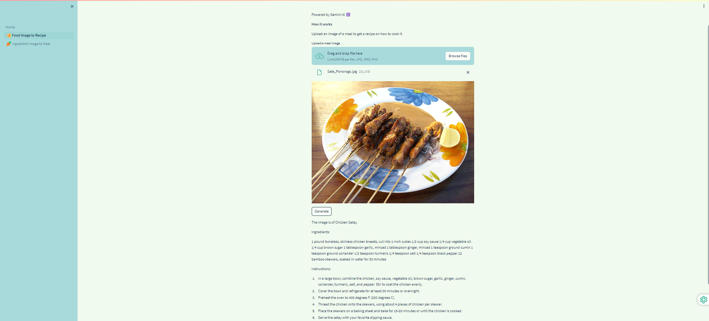
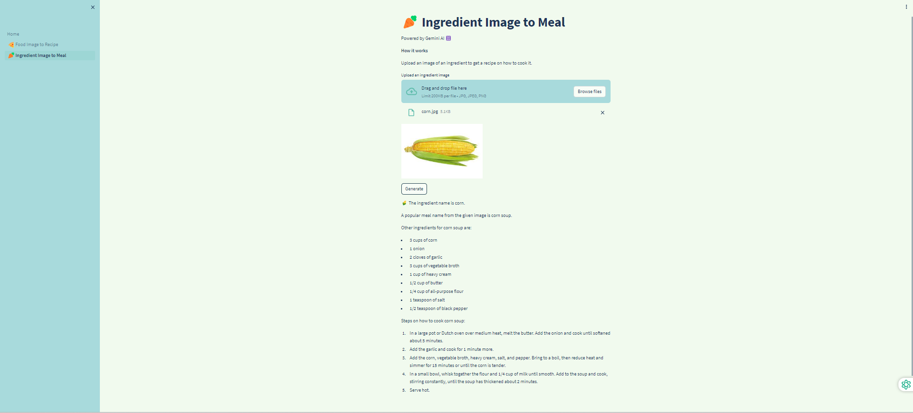
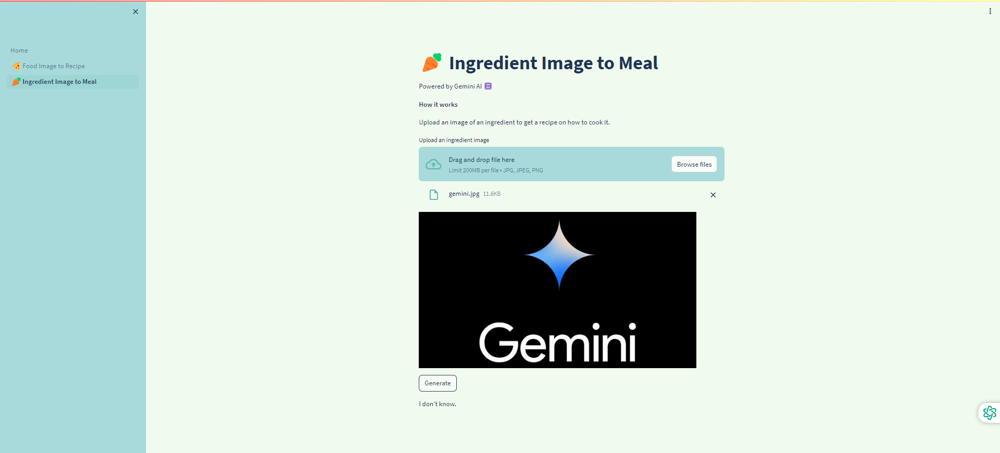
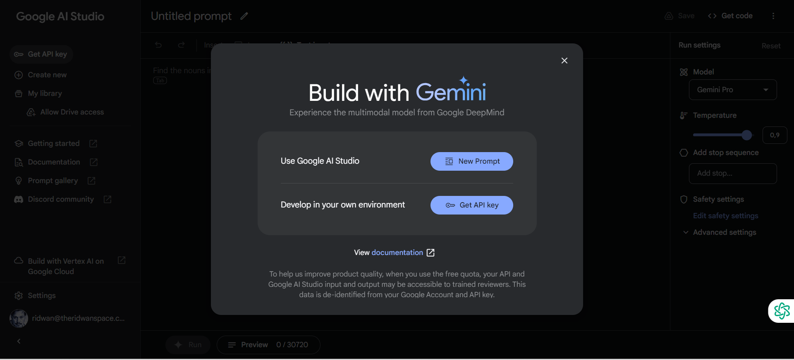

## Gemini AI Pro Vision: Turn Food Photos into Delicious Recipes!


### Project Overview

Welcome to [`Gemini AI Pro Vision`](https://cloud.google.com/vertex-ai/docs/generative-ai/multimodal/overview), where we bring the power of artificial intelligence to your kitchen, transforming the way you experience and create culinary delights. Say goodbye to tedious recipe searches and guesswork, and embrace a world where snapping a photo can lead you to a mouth-watering masterpiece!

### Unleash the Possibilities of AI in Your Kitchen

Imagine a world where you can create mouth-watering meals without searching for recipes or guessing the ingredients. Simply snap a photo of a dish that catches your eye, or capture an ingredient you're craving, and let AI guide you to culinary success!

### Unlock the Magic with Two Innovative Features:
**1. Meal Image to Recipe**

Have a captivating meal photo? Upload it, and our AI will identify the ingredients and suggest a delicious recipe to recreate it. Discover new dishes and expand your culinary horizons with ease!

**2. Ingredient Image to Meal**

Found a tempting ingredient but unsure what to make with it? Upload its photo, and our AI will recommend recipes that showcase its flavors beautifully. Spark your creativity and explore endless culinary possibilities!

**3. AI's Honest Answer**

Not sure if your image is an ingredient or a meal? Our AI will now respond with "I don't know" if the uploaded image doesn't fall into either category.

**4. Try it:**

- Choose your adventure: Select either "Meal Image to Recipe" or "Ingredient Image to Meal."
- Upload a photo: Capture the meal or ingredient that inspires you.
- Let AI work its magic: Our powerful model will analyze the image and suggest recipes tailored to your taste buds.
- Get cooking and enjoy!

### The Screenshots

`Screenshot 1`: _Meal image to recipe_



`Screenshot 2`: _Ingredient image to recipe_



`Screenshot 3`: _It is not a meal nor ingredient_




### Tech Stack
* [**Streamlit**](https://streamlit.io/): A web app framework for Python.
* [**Google AI Studio**](https://ai.google.dev/docs): A web-based tool that lets you prototype and run prompts right in your browser.
* [**Gemini AI**](https://blog.google/technology/ai/google-gemini-ai/): Gemini is Google's largest and most capable AI model.

### Installation
Follow the steps below to set up and run the code generation app:

#### 1. Clone the Repository

```bash
git clone https://github.com/ridwanspace/gemini-ai-recipe-generation.git
cd gemini-ai-recipe-generation
```

#### 2. Install Dependencies
```bash
pip install -r requirements.txt
```

#### 3. Get Your Gemini AI Key [here](https://makersuite.google.com/app/prompts/new_freeform)



#### 4. Create `env` file and pass Gemini AI API key
```bash
GEMINI_API_KEY = xxxxx
```

#### 5. Run the App
```bash
streamlit run Home.py
```


### Cost
- Check this Gemini AI [pricing](https://ai.google.dev/pricing)


